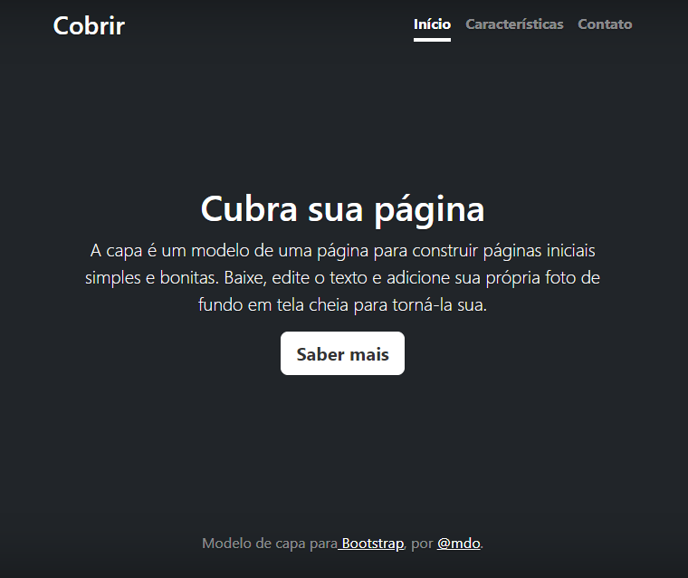

## Índicie
 
[Portifolio Pessoal](#portifolio-pessoal)  

[Descrição](#descri%C3%A7%C3%A3o)  

[Introdução](#introdu%C3%A7%C3%A3o)  

[Funcionalidade](#funcionalidade)  

[Tecnologias Utilizadas](#tecnologias-utilizadas)  

[Fontes Consultadas](#fontes-consultadas)  

[Autores](#autores)  

# Portifolio Pessoal
   
Projeto criado para utilizando examplos de Bootstrap para ensino de uso do README e do Bootstrat

## Descrição

 

## Introdução

 

## Funcionalidade

 

 

## Tecnologias Utilizadas

 

## Fontes Consultadas

 

## Autores
